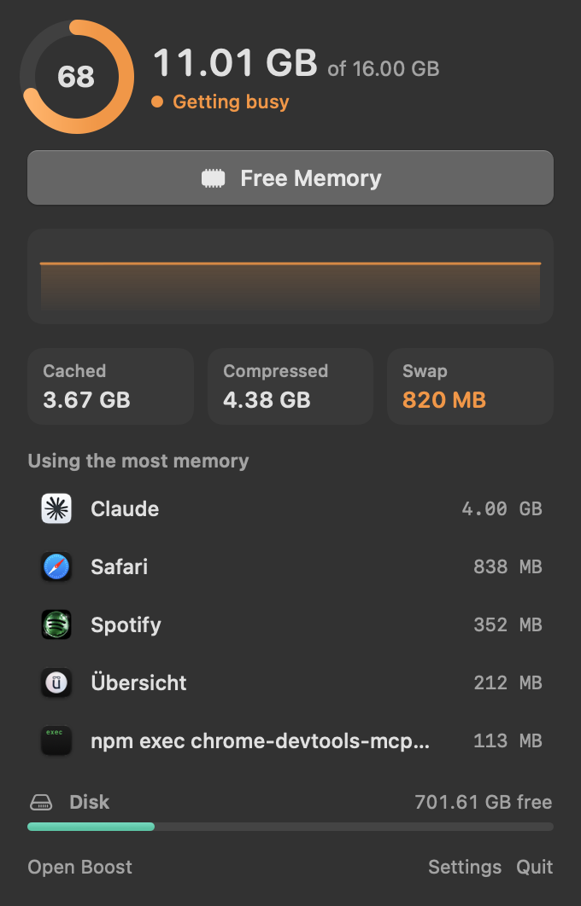
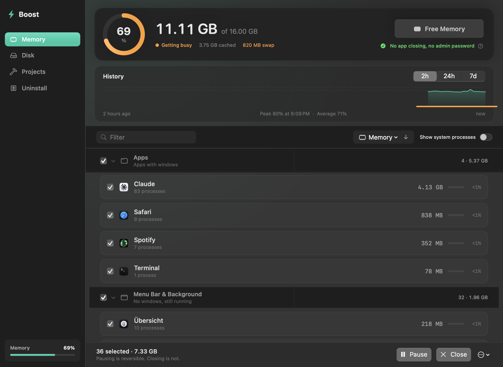
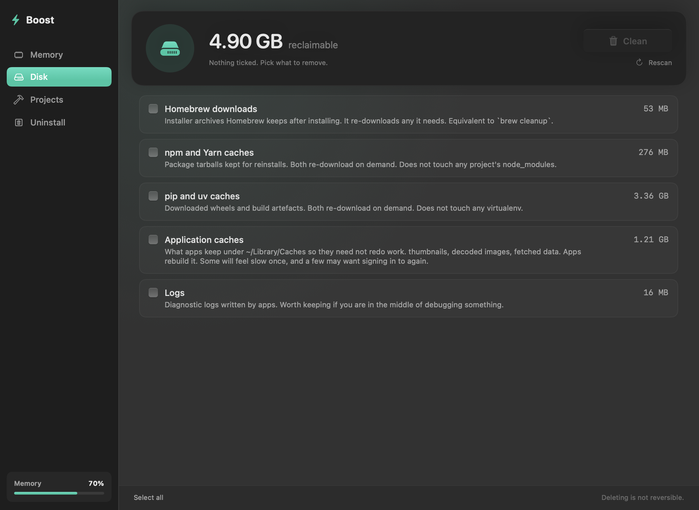
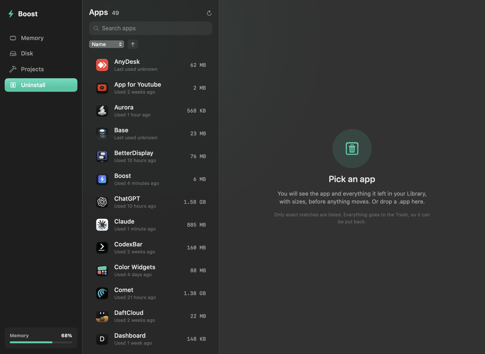
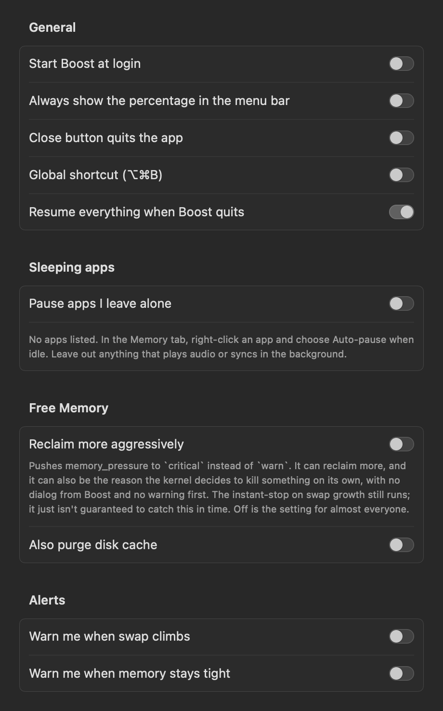

# Boost

A free, open source Mac app for memory and disk space. It lives in your menu
bar, shows what is using your RAM, freezes apps you are not using, and finds
caches and leftovers that are safe to remove.

If you have looked at CleanMyMac, iStat Menus or AppCleaner and did not want a
subscription, this covers the parts most people actually use.

<p align="center">
  
</p>

```bash
brew install --cask kernel-hunter/boost/boost
```

Or build it yourself, which takes about as long and involves no Gatekeeper at
all:

```bash
git clone https://github.com/Kernel-Hunter/boost.git
cd boost && ./Scripts/build.sh
```

macOS 14 or later, Apple Silicon and Intel, one universal binary. It builds with
Command Line Tools, so Xcode is not required. If Boost is useful to you, a star
helps other people find it.

> **On signing.** Boost is signed with a local certificate, not notarized,
> because notarizing needs a paid Apple Developer account. A downloaded `.zip`
> will be stopped by Gatekeeper the first time. The cask clears the quarantine
> flag for you, and building from source never sets one, so use one of those
> two. If you downloaded the zip anyway, right-click the app and choose Open.



## What you get

**A menu bar popover.** Click the icon and you see memory pressure, a short
graph, swap, how much is cached and compressed, and the five apps using the most
memory. Point at one to pause or quit it. Free Memory is one click away, and free
disk space sits at the bottom. The icon shows a number only when memory is
getting busy, or always if you turn that on.

**History.** Boost records a reading every minute and keeps a week. The Memory
tab charts it over 2 hours, 24 hours or 7 days, with the peak, the average and
how many times your Mac went into swap. That answers "was it slow at 3pm
yesterday" instead of leaving you to guess.

**Pause apps instead of quitting them.** Pause freezes an app and its helpers.
It uses no CPU, keeps its state, and comes back exactly where it was. Pick apps
to pause automatically after they sit in the background for 5 to 60 minutes.
Boost wakes each one the moment you switch to it. If Boost crashes or is killed,
a small watchdog resumes everything it froze, so nothing stays frozen.

**Alerts that mean something.** Boost can tell you when swap passes 1, 2 or 4 GB,
and when memory has stayed tight for a full minute, naming the app using the
most. A spike that passes on its own is ignored.

**Disk cleanup that refuses the risky parts.** It finds caches that the tool
that made them will rebuild: Homebrew, npm, pip, uv, Cargo, Gradle, Xcode
DerivedData, simulator caches, app caches, logs. It will not touch Downloads,
`node_modules` found by name, or iOS backups.



**Projects.** Finds `node_modules`, Rust `target`, SwiftPM `.build`, Python
virtualenvs, CocoaPods and similar folders in projects you have not touched for
30 to 180 days. A folder is listed only when the manifest next to it proves what
it is. Everything goes to the Trash.

**Uninstall.** Pick an app, or drop one onto the window, and Boost lists what it
left in your Library with sizes before anything moves. Only exact matches are
listed. Everything goes to the Trash, and there is an Undo.



**The small things.** Start at login. A Dock badge. An optional global shortcut
(⌥⌘B). Sort by name, memory or CPU. Reveal in Finder. Light and dark mode.



## Why it is built this way

Most Mac cleaners show you a big number and offer to make it smaller. The number
is usually cached memory, which macOS is using well, and shrinking it makes your
Mac slower. Boost does the opposite on purpose.

- It tells you when there is nothing to do. If swap is at zero, the header says
  your Mac is coping.
- It explains a figure before offering to change it. Cached memory is shown as
  available, because it is.
- Nothing is ticked for you. Removing files should be a decision.
- Projects and Uninstall move things to the Trash, so you can put them back. The
  Disk tab deletes, and says so on screen.
- Two safety layers guard deletion: an allowlist of what may be scanned, and a
  second check of the resolved path right before each removal. A symlink in a
  cache that points at your documents is how tools like this destroy data, and
  there is a test that builds exactly that trap.

### How Free Memory works

Windows tools like Mem Reduct call `EmptyWorkingSet`, which lets one process
push another process's pages to the pagefile. macOS has no public equivalent, as
[Apple's kernel source](https://github.com/apple-oss-distributions/xnu/blob/main/doc/vm/memorystatus_notify.md)
shows. It also would not help. macOS compresses memory instead of swapping
early, and reading a compressed page from RAM is much faster than reading it back
from an SSD.

So Boost uses what macOS does offer. It asks the system for memory through
Apple's own `memory_pressure` tool, which nudges the kernel to release idle pages
and compress what it can. Then it checks the readings before and after and
reports only what actually stopped being used. It does not close apps, delete
files or ask for a password, and it stops early if swap starts growing.

Expect a few hundred MB to around a gigabyte on a typical run. If your Mac is not
short on memory, there is little sitting idle to give back. Settings has an
aggressive mode that asks harder. It is off by default and warns you why: pushed
far enough, the kernel may kill something on its own.

## Permissions

| What | Why | When |
| --- | --- | --- |
| None | Reading the process table and memory stats, and signalling your own apps | Always |
| Accessibility | Counting an app's open windows | Only for "close button quits the app" |
| Notifications | The swap and pressure alerts | Only if you turn them on |
| Login item | Starting Boost at login | Only if you turn it on |
| Admin password | `/usr/sbin/purge` | Only if you turn on the optional disk cache purge |

No analytics, no telemetry, no update check, no network access of any kind.
There is nothing to opt out of. See [SECURITY.md](SECURITY.md).

## Command line

`boost.sh` does the same job headlessly, for a hotkey or a script.

```bash
./boost.sh              # close apps and helpers
./boost.sh --pause      # freeze them instead
./boost.sh --resume     # unfreeze everything, system-wide
./boost.sh --dry-run    # show what it would touch, change nothing
```

Pins made in the app are written to
`~/Library/Application Support/Boost/keep.txt`, and the script reads the same
file.

## Building and testing

```bash
./Scripts/build.sh          # build and install to /Applications
./Scripts/test.sh           # run the suite
```

Use `Scripts/test.sh` rather than `swift test`. See
[CONTRIBUTING.md](CONTRIBUTING.md) for the two flags it needs and why their error
messages blame the wrong thing.

To regenerate the screenshots in this README from the real views:

```bash
swift build && .build/debug/boost --snapshot docs/snapshots
```

## Is it free

Yes, and the parts that matter always will be. Safety, honest readings and
anything that already shipped free are not going behind a paywall. See the rules
written into [`Pro.swift`](Sources/BoostKit/Pro.swift).

## Licence

GPL-3.0. See [LICENSE](LICENSE).

Built by [Karim Masmoudi](https://github.com/Kernel-Hunter).
